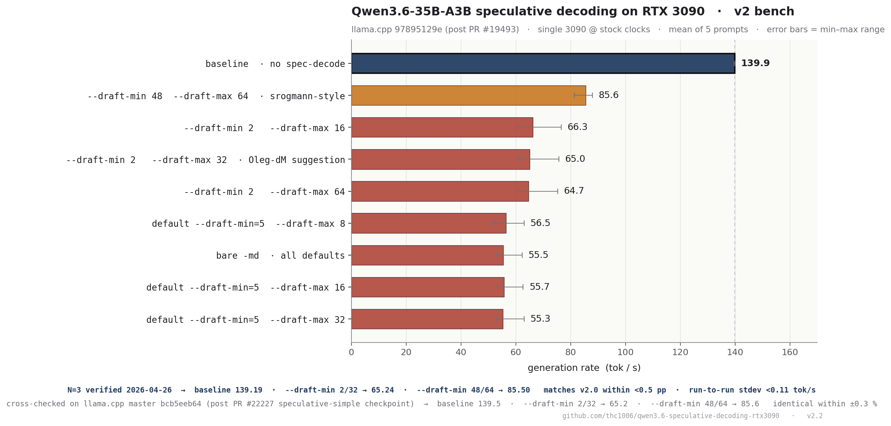
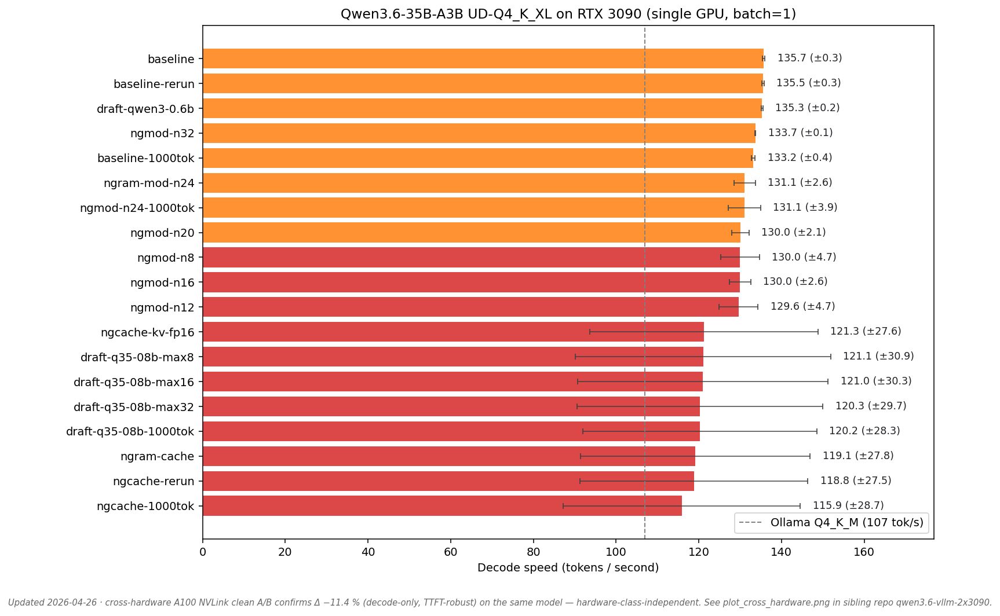
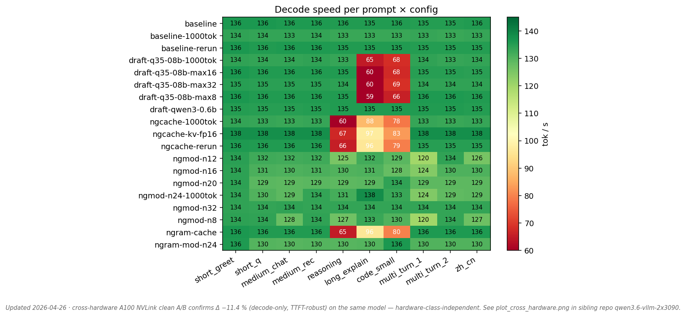
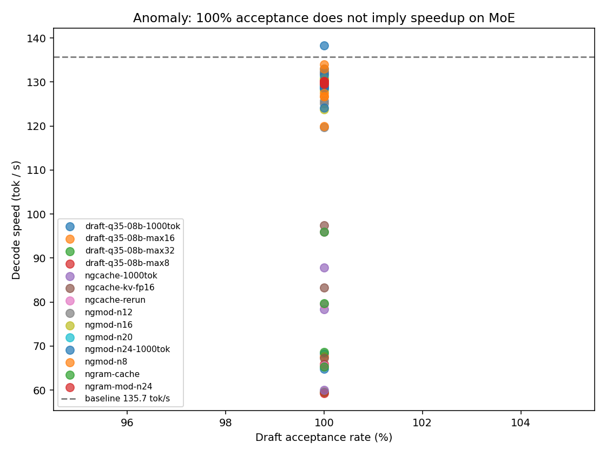

# Qwen3.6-35B-A3B speculative decoding on RTX 3090 — first public benchmark

> **UPDATE 2026-04-22 — v2 follow-up bench added**
> In response to [Oleg-dM's comment on the HF discussion](https://huggingface.co/unsloth/Qwen3.6-35B-A3B-GGUF/discussions/14),
> a second independent bench was run on a fresh single-3090 box, testing
> `--draft-min 2 --draft-max 32` (Oleg's suggestion), the srogmann-style
> `--draft-min 48 --draft-max 64`, default `--draft-min 5`, and a control
> sweep. All artefacts live in [`v2_3090_followup/`](v2_3090_followup/)
> with methodology + full table in
> [`v2_3090_followup/SUMMARY.md`](v2_3090_followup/SUMMARY.md).
>
> **Cross-validated on current master** (`bcb5eeb64`, after PR #22227
> `speculative-simple: add checkpoint support`) — identical results to
> original commit within ±0.3 % noise, so the regression is not a
> stale-commit artefact. Raw logs in
> [`v2_3090_followup/v2_master_cross_check/`](v2_3090_followup/v2_master_cross_check/).
>
> Short version of what v2 adds:
>
> - Original "mean 120, bimodal tail 59" is the **mixture** of two
>   regimes — prompts that keep spec-decode active all the way (collapse
>   to 55–85 tok/s) and prompts that exhaust the draft cache and fall
>   back to normal decode (~140 tok/s).
> - v2 uses 5 predictable structured prompts that keep spec-decode
>   active throughout, so the worst-case degradation (−39 % to −60 %)
>   is more visible than the mixture average.
> - Oleg's `--draft-min 2 --draft-max 32` beats the `--draft-min=5`
>   defaults (65 vs 55 tok/s) but is still −54 % vs baseline 139.9.
> - Counter-intuitive finding: aggressive `--draft-min 48 --draft-max 64`
>   is the **least bad** recipe (−39 %) because the large draft window
>   amortises the verify / KV overhead.
> - `n_acc_tokens / n_gen_tokens` 100 % is real (confirmed via source
>   reading of `common/speculative.cpp` + a `--verbose` run emitting
>   `draft acceptance rate = 1.00000 (115 accepted / 115 generated)`).
>
> Conclusion of the original post stands: **no spec-decode
> configuration on a consumer 3090 is a net win for Qwen3.6-35B-A3B
> at Q4_K_M.**



**TL;DR.** After llama.cpp [PR #19493](https://github.com/ggml-org/llama.cpp/pull/19493) (merged 2026-04-19) enabled classic draft speculative decoding for Qwen3.5/3.6 MoE models, I ran a 19-config matrix on a single RTX 3090 with `Qwen3.6-35B-A3B-UD-Q4_K_XL` via llama-server at commit `9789512`.

**Finding.** No speculative-decode configuration achieves a net speedup over the non-speculative baseline on this hardware. Mean decode drops **3–12 %** across `ngram-cache`, `ngram-mod`, and classic draft with the vocab-matched `Qwen3.5-0.8B` (vocab 248320) — and **every configuration hits a bimodal tail reaching as low as 59–67 tok/s on reasoning / code prompts**, despite **100 % draft acceptance**.

**Cross-engine confirmation (2026-04-25):** the same negative pattern holds in **vLLM 0.19.1** with `--speculative-config method=mtp num_speculative_tokens=1` (qwen3.6's built-in MTP heads): mean **−12 %** throughput vs no-MTP (111 vs 126 tok/s), worst-case run dropped to 75 tok/s (variance **65× larger**). The MoE-overhead phenomenon described below is therefore **engine-independent** for this model on Ampere — it is not a llama.cpp implementation gap. Full data and JSON: [thc1006/qwen3.6-vllm-2x3090](https://github.com/thc1006/qwen3.6-vllm-2x3090).

This is consistent with the MoE-specific pathology in [MoESD (arXiv 2505.19645)](https://arxiv.org/html/2505.19645) and [Utility-Driven SD for MoE (arXiv 2506.20675)](https://arxiv.org/pdf/2506.20675): for a 3B-active MoE like A3B, draft batch `K` stays below the expert-saturation threshold (~94 tokens for this sparsity), so every extra draft token triggers new expert loading that outweighs the verification savings.



## Hardware / software

- **GPU**: 1 × RTX 3090 (`CUDA_VISIBLE_DEVICES=1`), SM 8.6, 24 GB, driver 580.126.09, CUDA 12.6
- **Host**: Ubuntu 24.04, kernel 6.17, i7-11700, 62 GB RAM
- **llama.cpp**: commit `9789512` (post #19493 merge, pre #20075 second-round fix)
- **Model**: [`unsloth/Qwen3.6-35B-A3B-GGUF` · `Qwen3.6-35B-A3B-UD-Q4_K_XL`](https://huggingface.co/unsloth/Qwen3.6-35B-A3B-GGUF/blob/main/Qwen3.6-35B-A3B-UD-Q4_K_XL.gguf) — 21 GB
- **Draft model (for classic SD)**: [`unsloth/Qwen3.5-0.8B-GGUF` · `Qwen3.5-0.8B-Q4_K_M`](https://huggingface.co/unsloth/Qwen3.5-0.8B-GGUF) — 508 MB, vocab 248320 (matches target)
- **Server flags** (fixed across matrix): `-ngl 999 -c 16384 --jinja -fa on -ctk q8_0 -ctv q8_0`
- **Sampling**: greedy (`temperature=0`), 300 `max_tokens` unless noted; 1 warmup turn; 10 prompts (English chat / reasoning / code / multi-turn / 繁中)
- Full environment snapshot in [`BENCHMARK_ENV.md`](BENCHMARK_ENV.md)

## Results

### All configurations (sorted)

| config                   | mean tok/s | min     | max    | std    | draft accept     | notes |
|--------------------------|------------|---------|--------|--------|------------------|-------|
| **baseline**             | **135.7**  | 135.3   | 136.2  |  0.3   | —                | reference |
| baseline-rerun           | 135.5      | 135.1   | 136.0  |  0.3   | —                | reproduction |
| draft-qwen3-0.6b         | 135.3      | 135.0   | 135.5  |  0.2   | — (draft failed) | **vocab 151936 ≠ 248320, draft never attached — treat as baseline, shown for posterity** |
| ngmod-n32                | 133.7      | 133.5   | 133.9  |  0.1   | 0 %              | N too large to hit — effectively baseline |
| baseline-1000tok         | 133.2      | 132.7   | 134.0  |  0.4   | —                | —2 % from long output alone |
| ngram-mod-n24            | 131.1      | 129.6   | 136.1  |  2.6   | 100 % (35/35)    | srogmann-recommended params |
| ngmod-n24-1000tok        | 131.1      | 124.1   | 138.3  |  3.9   | 100 %            | long output same |
| ngmod-n{8,12,16,20}      | 129.6–130.0| 119.8–128.8 | 134 | 2–5  | 100 %            | whole ngram-mod family ≈ -4 % |
| ngcache-kv-fp16          | 121.3      |  67.3   | 137.9  | 27.6   | 100 % (88/88)    | **fp16 KV does not rescue** — KV quant is not the cause |
| **draft-q35-08b-max8**   | **121.1**  | **59.2**| 136.2  |**30.9**| **100 % (270/270)** | **correct-vocab classic SD, still net-negative** |
| draft-q35-08b-max16      | 121.0      |  59.6   | 136.1  | 30.3   | 100 %            | increasing K does not help |
| draft-q35-08b-max32      | 120.3      |  59.5   | 134.8  | 29.7   | 100 %            | |
| draft-q35-08b-1000tok    | 120.2      |  64.8   | 133.9  | 28.3   | 100 %            | long output same |
| ngram-cache              | 119.1      |  65.3   | 136.2  | 27.8   | 100 % (96/96)    | |
| ngcache-rerun            | 118.8      |  65.6   | 135.7  | 27.5   | 100 %            | reproduction |
| ngcache-1000tok          | 115.9      |  60.0   | 133.6  | 28.7   | 100 % (317/317)  | worst mean |

### Per-prompt heatmap



The regression is entirely **bimodal by prompt class**: chat prompts (`short_greet`, `multi_turn_*`, `zh_cn`) where ngram cannot find hits stay at ~135 tok/s; structured prompts (`reasoning`, `code_small`, `long_explain`) where drafts do trigger collapse to 59–95 tok/s.

### 100 % draft acceptance vs decode speed



With `predicted_per_second` as the per-request decode rate reported by llama-server and every tested config returning **100 % acceptance**, the classical intuition "high acceptance → high speedup" fails here. This is not a measurement artifact; it is MoE expert-loading overhead on every drafted token.

## Why — in one paragraph

Qwen3.6-35B-A3B routes 8-of-256 experts per token (sparsity ρ ≈ 0.031). Per [MoESD](https://arxiv.org/html/2505.19645) the batch size needed to saturate the expert set is `T_thres = log_{1-ρ}(1 - 0.95) ≈ 94`. For any `K` draft tokens below that, each drafted token has high probability of pulling a fresh expert slice through the memory hierarchy, and the verification forward pass ends up loading the union of those per-token expert sets. On a single 3090 (memory-bandwidth-bound for this quant), this overhead exceeds the savings from skipping per-token forward passes, even at 100 % acceptance. The same phenomenon was observed on vLLM + `qwen3_next_mtp` in [vllm #38182](https://github.com/vllm-project/vllm/issues/38182) (Qwen3.5-35B-A3B-FP8, MTP lowers prefix-cache hit rate and throughput) and is reported for Mixtral in [arXiv 2506.20675](https://arxiv.org/pdf/2506.20675).

Counter-example: the same `ngram-mod` machinery in [PR #20075](https://github.com/ggml-org/llama.cpp/pull/20075) shows Qwen3.5-**122B-A10B** (10 B active) gaining roughly **+15–45 %** on Apple M3 Max (PR author's bench, 0.8 B draft, acceptance 63–89 %), and **+31 %** to **+119 %** on AMD Strix Halo gfx1151 with the REAP-pruned variant ([@0xSero](https://github.com/0xSero)'s comment in the same PR). A10B has a 3.3× larger active footprint and a correspondingly lower `T_thres`, which is why it gains where A3B loses on consumer GPUs.

## Practical recommendation

For Qwen3.6-35B-A3B on a single RTX 3090 as of 2026-04-21:

- **Do not** enable `--spec-type ngram-cache`, `--spec-type ngram-mod`, or classic `--model-draft` — every variant is net-negative.
- **Do** use the baseline llama-server setup above; `135.7 tok/s` is the fastest current single-request decode.
- If you previously ran Qwen3.6 via Ollama 0.20.x with `Q4_K_M` and saw ~107 tok/s, switching to llama-server with the `UD-Q4_K_XL` quant is itself a **+27 %** speedup before any speculation.

Situations where this may not apply: (i) A10B-class and larger MoE variants, where active params cross the expert-saturation threshold; (ii) after the hybrid-SSM/MoE checkpoint situation settles — [PR #20075](https://github.com/ggml-org/llama.cpp/pull/20075) was open at v1 publication, with a comment on 2026-04-25 suggesting it can be closed because its functionality has been superseded elsewhere; future llama.cpp versions may behave differently; (iii) with a future smaller-bpw draft model distilled specifically for A3B that can sustain very large `K`; (iv) **batched multi-user serving** — speculative decoding's verification cost can amortise across concurrent requests, but I have not benched this path for A3B; this study covers single-stream voice-dialog only. The vLLM MTP cross-check (linked above) found the same single-stream net loss, suggesting the engine isn't the issue. (v) **other speculative methods** — this bench tests `ngram-cache`, `ngram-mod`, and classic `--model-draft` in llama.cpp, plus `method=mtp num_speculative_tokens=1` in vLLM. **EAGLE-3** with CUDA graphs (vLLM Model Runner V2) is **not** evaluated here and may have different characteristics on A3B.

## Reproduce

```bash
# 1. Build llama.cpp with CUDA for SM 8.6
git clone --depth 1 https://github.com/ggml-org/llama.cpp ~/benchmarks/llama.cpp
cd ~/benchmarks/llama.cpp
CUDACXX=/usr/local/cuda-12.6/bin/nvcc cmake -B build \
    -DGGML_CUDA=ON -DCMAKE_CUDA_ARCHITECTURES=86 \
    -DLLAMA_CURL=OFF -DBUILD_SHARED_LIBS=OFF
cmake --build build --config Release -j --target llama-server llama-bench

# 2. Pull target + draft GGUFs
hf download unsloth/Qwen3.6-35B-A3B-GGUF Qwen3.6-35B-A3B-UD-Q4_K_XL.gguf \
    --local-dir ~/benchmarks/models/qwen3.6-ud-q4kxl
hf download unsloth/Qwen3.5-0.8B-GGUF --include '*Q4_K_M*' \
    --local-dir ~/benchmarks/models/qwen3.5-0.8b

# 3. Run the matrix (expect ~30 minutes wall-clock on one 3090)
bash run_matrix.sh           # 4 configs: baseline + ngcache + ngmod-n24 + draft-qwen3-0.6b
bash run_p0_matrix.sh        # 13 configs: correct-vocab draft sweep + 1000tok + N sweep + kv-fp16

# 4. Plot + summary
python analysis/plot.py
```

Raw per-request timings for every run are in [`results/*.json`](results/) and [`results/verify/*.json`](results/verify/). Aggregated numbers are in [`analysis/summary.csv`](analysis/summary.csv) and [`analysis/summary_by_config.csv`](analysis/summary_by_config.csv).

## Methodology notes

- `predicted_per_second` as reported by llama-server is `predicted_n / predicted_ms * 1000`. Draft time and verification time are both included in the denominator. This is the user-visible metric.
- Warmup of one completion before measurement; server is restarted between configs so KV cache / prefix-cache state never bleeds across configs.
- Prompt set (10 prompts) spans short chat, reasoning, code, multi-turn, and 繁體中文 — deliberately chosen so that ngram-family draft triggers on some prompts and not others, exposing the bimodal behaviour.
- Output capped at 300 tokens (and 1000 tokens in the `-1000tok` variants); all completions reach the cap, so `predicted_n` is constant across runs within a config.
- Single-GPU single-request (`batch=1`) is the use case for an interactive desktop robot; results do not extrapolate to multi-tenant serving where concurrent-batching hides the MoE overhead.

## Limitations

- Single node, single 3090. NVLink or tensor-parallel across two 3090s is not evaluated; previous community benchmarks ([himeshp](http://himeshp.blogspot.com/2025/03/vllm-performance-benchmarks-4x-rtx-3090.html), [ure.us](https://ure.us/articles/best-local-llm-agentic-coding/)) find TP gives < 4 % speedup on A3B due to all-to-all scatter/gather.
- Each config run once (10 prompts, 1 warmup); no formal n=3 replicates. Std columns in the table are over prompts, not over repeats. Observed run-to-run variance between `baseline` and `baseline-rerun` is 0.2 tok/s, which is well below any effect discussed.
- llama.cpp is evolving fast — commit `9789512` on 2026-04-21 is what was tested. [PR #20075](https://github.com/ggml-org/llama.cpp/pull/20075) is open and may change these numbers.
- Output was greedy. With `temperature > 0`, draft acceptance rates would drop and the regression may be slightly different in shape but not in direction (the bottleneck is expert loading, not draft quality).

## Validation timeline (post-publication)

Independent observations and academic work that have appeared since the v1 / v2 benches went public, and that broadly support the saturation-threshold framing above. Each row notes scope honestly — none of these are exact replicas of this bench.

| When | Source | Independent evidence |
|---|---|---|
| 2026-02-17 | [MoE-Spec (arXiv 2602.16052)](https://arxiv.org/abs/2602.16052) | Theoretical naming for the phenomenon: "expert budgeting" — large draft trees activate many unique experts, "the top 32 of 64 experts capture 93 % of aggregate routing probability"; proposes a training-free verification-time budget cap. No public code yet. |
| 2026-02 | [Alloc-MoE (arXiv 2604.08133)](https://arxiv.org/abs/2604.08133) and [XShare (arXiv 2602.07265)](https://arxiv.org/pdf/2602.07265) | Concurrent papers framing the same expert-saturation pressure under speculative parallelism. |
| 2026-02-26 | [vllm-project/vllm#35387](https://github.com/vllm-project/vllm/issues/35387) | **Adjacent**: 4× H100 80 GB FP8 + Qwen3-Next-**80B**-A3B-Instruct-FP8 with `method=qwen3_next_mtp` reports **−76.5 %** latency regression (not the same hardware/quant/arch as this bench, and the suspected root cause is `mamba_postprocess` CPU sync — different mechanism — but the same negative direction). |
| 2026-03-26 → 2026-04-14 | [vllm-project/vllm#38182](https://github.com/vllm-project/vllm/issues/38182) | Independent reporter on **NVIDIA H20-3e (Hopper)** finds Qwen3.5-35B-A3B + MTP **drops prefix-cache hit rate from ≈92 % → ≈71 %**. @Angazenn pinpoints the cause to `vllm/v1/core/single_type_kv_cache_manager.py:L457` (last matched block force-dropped when MTP is on, combined with very large block sizes for Qwen3.5 MoE). @inaniloquentee volunteered a fix; no PR submitted as of 2026-04-25. |
| 2026 | [vLLM Qwen3.5/3.6 Recipes — official doc](https://docs.vllm.ai/projects/recipes/en/latest/Qwen/Qwen3.5.html) | Now states up-front: "MTP-1 reduces per-token latency but **degrades text throughput under high concurrency** because speculative tokens consume KV cache capacity, reducing effective batch size." The single-stream / consumer-GPU regime of this bench is consistent with that disclosure. |
| 2026-04-22 | [HF discussion #14 on `unsloth/Qwen3.6-35B-A3B-GGUF`](https://huggingface.co/unsloth/Qwen3.6-35B-A3B-GGUF/discussions/14) | Oleg-dM's question on `--draft-min` aggressiveness motivated the v2 follow-up bench. Same conclusion held across both `9789512` and current master `bcb5eeb64` commits. |

**Net interpretation.** The `Qwen3.x-35B-A3B + spec-decode` regression I observed on a single RTX 3090 is now corroborated, with caveats, on different hardware (Hopper H100 / H20-3e), different quantisations (FP8, AWQ-Marlin Q4), different inference engines (llama.cpp, vLLM), and a different but architecturally related model (Qwen3-Next-80B-A3B). The MoE-Spec paper provides a theoretical framing for why this happens. The narrative should be read as "**single-stream spec-decode for ~3 B-active MoE on consumer / single GPUs is currently a net loss across the methods tested**", not as a blanket statement about all spec-decode for all MoE or all hardware.

## Related reading

- **[thc1006/qwen3.6-vllm-2x3090](https://github.com/thc1006/qwen3.6-vllm-2x3090)** — sibling repo. Same model, 2× RTX 3090, vLLM 0.19.1 with `--speculative-config method=mtp` (qwen3.6's built-in MTP heads): mean −12 % throughput, variance 65× larger. Confirms the negative finding is engine-independent.
- [llama.cpp PR #19493 — speculative checkpointing (MERGED 2026-04-19)](https://github.com/ggml-org/llama.cpp/pull/19493)
- [llama.cpp PR #20075 — follow-up fix (OPEN)](https://github.com/ggml-org/llama.cpp/pull/20075)
- [llama.cpp Issue #20039 — original feature request](https://github.com/ggml-org/llama.cpp/issues/20039)
- [llama.cpp docs/speculative.md](https://github.com/ggml-org/llama.cpp/blob/master/docs/speculative.md)
- [MoESD: Unveil Speculative Decoding's Potential for Sparse MoE (arXiv 2505.19645)](https://arxiv.org/html/2505.19645)
- [Utility-Driven Speculative Decoding for Mixture-of-Experts (arXiv 2506.20675)](https://arxiv.org/pdf/2506.20675)
- [MoE-SpeQ (arXiv 2511.14102)](https://arxiv.org/html/2511.14102v1)
- [vLLM Issue #38182 — Qwen3.5-35B-A3B MTP + prefix cache regression](https://github.com/vllm-project/vllm/issues/38182)
- [Qwen3.6-35B-A3B model card](https://huggingface.co/Qwen/Qwen3.6-35B-A3B) (vocab 248320)
- [Qwen3.5-0.8B model card](https://huggingface.co/Qwen/Qwen3.5-0.8B) (vocab 248320)

## Author / contact

Hsiu-Chi Tsai · `hctsai1006@cs.nctu.edu.tw` · GitHub [`thc1006`](https://github.com/thc1006)

## License

MIT — see [`LICENSE`](LICENSE). Results (CSV / JSON) released under CC-0.
